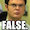
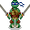

### HipChat Icons

This is a repo for some extra HipChat Icons.

*  (bender)
*  (ahahah)
*  (dude)
*  (false)
*  (genius)
*  (ginger)
*  (hero)
*  (icecube)
*  (lookatit)
*  (bot)
*  (gogogo)
*  (timeforthat)
*  (tmnt)
*  (yoda)

##### Adding Icons

If you want to add an icon please send me a Pull Request with a link to the image, and the text that will map to it. Images need to be 30px by 30px in either .png or .jpg format

##### Default Icons

* http://hipchat-emoticons.nyh.name/
